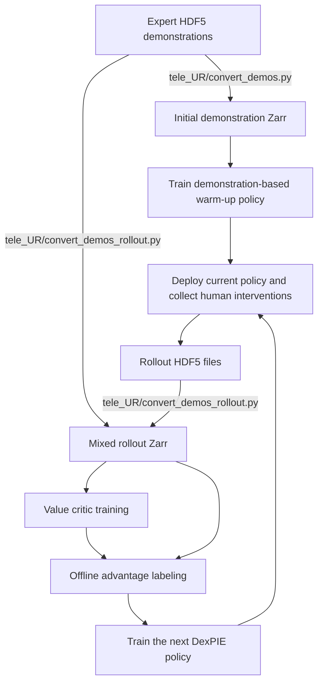

# DexPIE

[](https://siiuuuuuu.github.io/DexPIE/)
[](https://arxiv.org/abs/2606.09615)
[](LICENSE)

**DexPIE: Stable Dexterous Policy Improvement from Real-World Experience**

DexPIE is a UR arm and Inspire Hand manipulation framework for training,
improving, and deploying image-based diffusion policies from real-world
demonstrations, autonomous rollouts, and human interventions. This repository
contains the policy, value critic, offline advantage labeling, real-time
deployment, and intervention-collection code. Initial teleoperation and HDF5
to Zarr conversion are provided by the companion `tele_UR` repository. Refer
to that repository for detailed hardware installation, device connections,
RealSense and robot time alignment, and teleoperation setup.

## Overview

The current system combines:

- front-view and optional wrist-view RealSense RGB observations;
- a UR robot arm and an Inspire dexterous hand;
- an R3M visual encoder and a 1D diffusion action model;
- RTC executed-action prefix conditioning for inference-delay compensation;
- asynchronous GPU policy inference with Ray;
- direct interpolation from the policy rate to high-rate arm and hand control;
- a distributional value critic and offline per-frame advantage labels;
- advantage-conditioned policy improvement with classifier-free guidance; and
- autonomous rollout collection with optional human intervention.

## Training and Improvement Pipeline



The first demonstration-based policy is a warm-up policy used to collect the
initial autonomous rollouts and expert interventions. It is not necessarily a
weight initialization for DexPIE. After training the critic, labeling
advantages, and training DexPIE once, deploy the new DexPIE policy to collect
the next intervention dataset and repeat the same critic/advantage/policy
cycle. From the second DexPIE iteration onward, the previous DexPIE checkpoint
can optionally initialize the next DexPIE run.

## Policy Variants

| Configuration | Task configuration | Description |
| --- | --- | --- |
| `RTC_dp_224x224_r3m` | `two-image` or `dp-image` | Baseline RTC image diffusion policy |
| `RTC_Recap` | `Recap-image` | Binary advantage-conditioned policy with classifier-free guidance |
| `DexPIE` | `Recap-image` | Continuous advantage-conditioned policy with classifier-free guidance |
| `critic` | `value_image` | Distributional image-based value critic |

`RTC_Recap` converts an advantage threshold into a binary positive condition.
`DexPIE` instead maps advantage to a smooth score in `[0, 1]`; training windows
dominated by human intervention are assigned the maximum positive score. At
inference time, both conditioned policies request the positive condition and
use classifier-free guidance to favor higher-quality actions.

## Hardware Requirements

For detailed hardware installation, device connections, and teleoperation
setup, first refer to the companion `tele_UR` repository.

The deployment and intervention paths currently target:

- a UR robot with RTDE and Remote Control enabled;
- an Inspire Hand connected over serial;
- one front RealSense camera;
- one wrist RealSense camera for the two-image configurations;
- an NVIDIA CUDA GPU for policy inference; and
- an OpenVR tracker and MANUS glove for human intervention.

Before commanding a real robot, inspect the constants at the top of
`DexPIE/RTC_policy_deploy.py` and `DexPIE/RTC_expert_interve_collect.py`.
Important defaults include:

| Setting | Default |
| --- | --- |
| UR address | `192.168.3.6` |
| Inspire Hand port | `/dev/ttyUSB0` |
| Inspire Hand baud rate | `115200` |
| Policy period | `1/30 s` |
| Arm servo rate | `120 Hz` |
| Hand command rate | `120 Hz` |
| Robot-state rate | `125 Hz` |
| Front/wrist camera rates | `30/60 Hz` |
| MANUS ZMQ endpoint | `tcp://127.0.0.1:2044` |

The initial TCP pose, workspace limits, camera selection, serial port, and data
output directories are also machine-specific. Verify them before use. Keep an
emergency stop available and test new configurations at low speed in a clear
workspace.

`pynput` and OpenVR require access to a graphical desktop session and may not
work in a headless SSH session.

## Installation

Python 3.8 is used by the provided environment. The checked-in environment
records the dependency versions used for this codebase, including PyTorch
2.0.1 with CUDA 11.8, Ray 2.10, Hydra 1.2, Diffusers 0.11.1, Zarr 2.12,
`pyrealsense2` 2.55.1, and `ur-rtde` 1.6.2.

```bash
conda env create -f environment.yml
conda activate DexPIE

pip install -e third_party/r3m
pip install -e DexPIE
```

Install the Intel RealSense SDK and its udev rules before using the cameras.
The Python package alone does not install the system driver. If access to the
Inspire Hand serial device is denied, configure a persistent udev rule or set a
temporary permission:

```bash
sudo chmod 666 /dev/ttyUSB0
```

## Data Preparation

Raw demonstration and rollout episodes are stored as HDF5 files. Conversion to
the training Zarr format is handled in the companion `tele_UR` repository.

### Expert demonstrations

For regular teleoperation demonstrations, configure and run:

```bash
cd /path/to/tele_UR
bash convert_data.sh
```

This invokes `convert_demos.py`, converts image/state/action data, and treats
the expert episodes as successful.

### Rollouts and human interventions

For policy rollouts, intervention data, or merged expert/rollout directories,
configure and run:

```bash
cd /path/to/tele_UR
bash convert_rollout_data.sh
```

This invokes `convert_demos_rollout.py`, preserves the episode-level `success`
attribute and per-step `intervention` labels, and can merge multiple HDF5
directories into one Zarr dataset.

`intervention` is optional for pure expert-demonstration datasets, but it
should be preserved for mixed autonomous-rollout and human-intervention
datasets:

- `false`: the action was produced autonomously by the policy;
- `true`: the action was produced during human intervention.

For training, a sampled window is intervention-positive when intervention
covers more than one third of its valid action steps. `RTC_Recap` treats that
window as positive, while `DexPIE` assigns it a positive score of `1`.

## Zarr Data Schema

The complete policy-improvement dataset has the following logical layout:

```text
dataset.zarr/
├── data/
│   ├── img             # front RGB images, [N, H, W, 3]
│   ├── wrist_img       # wrist RGB images, [N, H, W, 3]
│   ├── state           # robot state, typically [N, 12]
│   ├── action          # robot and hand action, [N, 15]
│   ├── intervention    # optional per-step bool labels
│   └── advantage       # added by offline advantage labeling
└── meta/
    ├── episode_ends    # cumulative episode-end indices
    └── success         # per-episode bool labels
```

The policy uses the first six state dimensions as `agent_pos`. When available,
the remaining six dimensions represent the current TCP pose and are used as
the reference for relative arm actions. Each 15-dimensional action contains a
9-dimensional arm pose (`xyz` plus 6D rotation) and six Inspire Hand commands.

The baseline dataset does not require `intervention` or `advantage`. The
`RTC_Recap` and `DexPIE` workspaces require precomputed `data/advantage` and an
`advantage_quantiles.json` file. A meaningful critic dataset should also carry
correct episode-level success/failure labels.

## Rollout Collection with Human Intervention

Before running the collector, review the constants at the top of
`DexPIE/RTC_expert_interve_collect.py`. In particular, configure:

- `DEFAULT_DATA_DIR`: directory used to save rollout HDF5 files;
- `DEFAULT_UR_HOST`, `DEFAULT_WORKSPACE_LIMITS`, and `DEFAULT_INITIAL_POSE`;
- `DEFAULT_HAND_PORT`, baud rate, and hand reset command;
- camera image size and front/wrist camera rates; and
- policy, tracker, robot-state, arm-servo, and hand-control rates.

Also verify the dataset and checkpoint run identifiers in
`scripts/RTC_expert_interve_collect.sh`. These settings are hardware- and
machine-specific and should be checked before every deployment setup.

This path runs the policy while allowing an operator to take control through
an OpenVR tracker and MANUS glove. For the first iteration, collect rollouts
from the demonstration-based warm-up policy:

```bash
bash scripts/RTC_expert_interve_collect.sh \
  RTC_dp_224x224_r3m \
  two-image \
  <warmup-tag>
```

After the first DexPIE policy has been trained, use its checkpoint for the
next iteration:

```bash
bash scripts/RTC_expert_interve_collect.sh \
  DexPIE \
  Recap-image \
  <iteration-tag>
```

Keyboard controls are:

- `s`: start or stop recording an episode;
- `e`: enter or leave human-intervention mode;
- `c`: finish collection.

After pressing `s` to finish a non-empty episode, confirm both prompts in the
terminal: first whether the task succeeded, and then whether to save the
recording. Enter `y` or `n` for each prompt.

```text
color
wrist_color
env_qpos_proprioception
action
intervention
timestamps/
success (HDF5 attribute)
```

The output directory is currently configured by `DEFAULT_DATA_DIR` in
`DexPIE/RTC_expert_interve_collect.py`. Convert and merge the saved episodes
with `tele_UR/convert_demos_rollout.py`, retrain the critic on the expanded
dataset, recompute advantage labels, and train the next DexPIE policy. Repeat
this loop for subsequent policy-improvement iterations.

## Quick Start

All provided shell scripts are launched from the repository root and then
change into the nested `DexPIE/` package directory. Before running them, edit
their `dataset_path`, GPU, run tag, and other machine-specific values.

The common script arguments are:

```text
bash <script> <algorithm> <task> <tag>
```

The output directory is derived from these values as:

```text
DexPIE/data/outputs/<task>-<algorithm>-<tag>_seed0
```

### 1. Train the demonstration-based warm-up policy

Convert the initial expert demonstrations to Zarr and train a dual-camera RTC
policy:

```bash
bash scripts/train_policy.sh RTC_dp_224x224_r3m two-image <warmup-tag>
```

This policy provides a reasonable starting behavior for the first rollout. It
is used for data collection; it is not required to initialize the DexPIE model
weights. Checkpoints are written under the run directory's `checkpoints/`
folder.

### 2. Collect the first intervention rollouts

Deploy the warm-up checkpoint with the expert-intervention collector:

```bash
bash scripts/RTC_expert_interve_collect.sh \
  RTC_dp_224x224_r3m \
  two-image \
  <warmup-tag>
```

Allow the policy to act autonomously and press `e` whenever expert correction
is needed. Mark each completed episode as successful or failed when prompted.
The saved HDF5 files contain both the episode outcome and per-step
`intervention` labels.

### 3. Build the mixed rollout dataset

In the companion `tele_UR` repository, configure the initial expert HDF5
directory and the new rollout HDF5 directory, then merge them:

```bash
cd /path/to/tele_UR
bash convert_rollout_data.sh
```

The resulting Zarr dataset must preserve `meta/success` and
`data/intervention`. Use this mixed dataset for the critic, advantage labeling,
and DexPIE training steps below.

### 4. Train the value critic

Set `dataset_path` in `scripts/train_critic.sh` to the mixed Zarr dataset with
accurate `meta/success` labels, then run from the DexPIE repository root:

```bash
bash scripts/train_critic.sh critic value_image <iteration-tag>
```

The critic predicts a categorical value distribution over 201 bins in
`[-1, 0]`. Successful trajectories receive a progress-based return; failed
trajectories receive an additional failure penalty.

### 5. Compute offline advantages

Run the advantage tool with the newly trained critic and the same mixed
dataset:

```bash
bash scripts/compute_advantage_quantiles.sh \
  /path/to/critic/latest.ckpt \
  /path/to/mixed_dataset.zarr \
  DexPIE \
  Recap-image
```

The tool evaluates the critic, writes `data/advantage` into the Zarr dataset,
stores labeling metadata in the Zarr attributes, and creates
`advantage_quantiles.json` next to the dataset arrays. Existing advantage
labels are overwritten by default.

The per-step label uses the end of the current policy horizon:

```text
advantage[t] = -(end_t - t) / max_length + V[end_t] - V[t]
```

### 6. Train DexPIE

Before training, verify that the mixed Zarr dataset contains
`data/intervention`, `data/advantage`, `meta/success`, and
`advantage_quantiles.json`. The value critic is used by the offline labeling
step; DexPIE policy training consumes the stored labels and does not run the
critic online.

```bash
bash scripts/train_policy.sh DexPIE Recap-image <iteration-tag>
```

The first DexPIE run is trained from the labeled mixed dataset. For later
DexPIE iterations, `training.init_ckpt_path` can initialize the model and EMA
weights from the previous DexPIE checkpoint without restoring its optimizer,
epoch, or global step. In contrast, `training.resume=True` restores
`latest.ckpt` from the current run directory when it exists.

### 7. Deploy, recollect, and repeat

Use the new DexPIE checkpoint for another intervention rollout:

```bash
bash scripts/RTC_expert_interve_collect.sh \
  DexPIE \
  Recap-image \
  <iteration-tag>
```

Merge the new HDF5 episodes into the next Zarr dataset, retrain the critic,
recompute all advantage labels, and train the next DexPIE policy. Repeating
Steps 3-7 completes successive policy-improvement iterations.

## Visualization

### Critic value curves

```bash
bash scripts/vis_value_trend.sh \
  /path/to/critic/latest.ckpt \
  /path/to/dataset.zarr \
  5 \
  42 \
  visualizations/critic_value_random_trajectories.png
```

The script evaluates frame-wise critic values on random episodes or on an
explicit episode range and saves a plot.

### Advantage playback

```bash
bash scripts/visualize_zarr_advantage_playback.sh \
  /path/to/dataset.zarr \
  25 \
  /path/to/dataset.zarr/advantage_quantiles.json \
  0
```

The viewer synchronizes the front and wrist images with the advantage curve,
quantile thresholds, and intervention timeline. Controls are:

- `Space`: pause or resume;
- `f` / `b`: move forward or backward by 10 frames;
- `r`: restart the current episode;
- `n` / `p`: next or previous episode; and
- `q`: quit.

## Pure Policy Deployment

Edit the dataset/checkpoint identifiers in the launcher and the hardware
constants in `DexPIE/RTC_policy_deploy.py`, then run:

```bash
bash scripts/RTC_policy_deploy.sh DexPIE Recap-image <tag>
```

The launcher reconstructs the run directory from the three arguments and
loads `checkpoints/latest.ckpt`. Deployment uses an asynchronous Ray GPU actor,
conditions each new diffusion trajectory on any already executed action
prefix, and sends the resulting sequence to high-rate arm and hand executors.
The current arm path uses direct interpolation rather than MPC.

Pure deployment does not save HDF5 data and does not initialize the human
intervention devices. Keyboard controls are:

- `s`: start or stop a policy episode;
- `c`: finish deployment.

The following environment variables override runtime alignment settings:

| Variable | Default | Meaning |
| --- | --- | --- |
| `RTC_POLICY_DT` | `1/30` | Policy control period in seconds |
| `RTC_POLICY_MAX_TASK_LENGTH` | `1000` | Maximum policy steps per episode |
| `RTC_OBS_LATENCY_STEPS` | `1` | Observation latency in policy steps |
| `RTC_ACTION_OFFSET_STEPS` | Zarr attribute or `1` | Training action-label offset |

If `RTC_ACTION_OFFSET_STEPS` is not set, deployment reads
`action_offset_frames` from the selected Zarr root when available and falls
back to `1` for datasets without that attribute. These alignment parameters
must remain consistent with data conversion.

## Checkpoints and Outputs

A typical training run produces:

```text
DexPIE/data/outputs/<task>-<algorithm>-<tag>_seed0/
├── checkpoints/
│   └── latest.ckpt
├── logs.json.txt
└── wandb/
```

The checkpoint payload contains the resolved Hydra configuration, model and
optimizer state, and training counters. Policies normally deploy the EMA model
when `training.use_ema=True`.

If inference reports that a checkpoint is missing, first verify that the
launcher arguments reconstruct the same run directory used during training.

## Repository Structure

```text
.
├── README.md
├── environment.yml
├── scripts/                          # training, deployment, and analysis launchers
├── third_party/
│   ├── r3m/
│   └── visualizer/
└── DexPIE/
    ├── train.py                      # Hydra training entry point
    ├── RTC_policy_deploy.py          # pure RTC deployment
    ├── RTC_expert_interve_collect.py # rollout and intervention collection
    ├── compute_advantage_quantiles.py
    ├── visualize_critic_values.py
    ├── communication/                # UR and Inspire Hand interfaces
    ├── human_intervention/           # OpenVR and MANUS intervention stack
    └── dexpie/
        ├── config/                   # algorithm and task configurations
        ├── dataset/                  # policy and value datasets
        ├── model/                    # vision, diffusion, and value networks
        ├── policy/                   # baseline, Recap, DexPIE, and critic policies
        ├── workspace/                # training and checkpoint workflows
        └── common/                   # RTC, alignment, replay, and executor utilities
```

## Known Limitations

- Robot addresses, camera selection, serial ports, initial poses, and several
  dataset/checkpoint paths are currently machine-specific defaults.
- HDF5 collection/conversion utilities are split between this repository and
  the companion `tele_UR` repository.
- The current task configurations primarily target dual 224x224 RGB inputs, a
  six-dimensional robot observation, and a 15-dimensional action.
- Deployment and intervention require real hardware and cannot be fully
  validated through a software-only test.
- Changing camera rate, action-label offset, or control rate requires
  rechecking timestamp alignment and latency compensation.

## BibTeX

Please consider citing our work if you find this repository useful:

```bibtex
@article{liao2026dexpie,
  title         = {{DexPIE}: Stable Dexterous Policy Improvement from Real-World Experience},
  author        = {Liao, Ruizhe and Chen, Wenrui and Zeng, Liangji and Lin, Haoran and Yang, Fan and Yang, Kailun and Wang, Yaonan},
  journal       = {arXiv preprint arXiv:2606.09615},
  year          = {2026},
  doi           = {10.48550/arXiv.2606.09615},
  url           = {https://arxiv.org/abs/2606.09615},
  eprint        = {2606.09615},
  archivePrefix = {arXiv},
  primaryClass  = {cs.RO}
}
```

## License

This project is released under the [MIT License](LICENSE).

## Acknowledgements

We thank the authors of
[Diffusion Policy](https://github.com/real-stanford/diffusion_policy),
[R3M](https://github.com/facebookresearch/r3m),
[iDP3 / Humanoid-Teleoperation](https://github.com/YanjieZe/Humanoid-Teleoperation),
and [RealtimeVLA v2](https://dexmal.github.io/realtime-vla-v2/) for their
open-source work and valuable inspiration.
